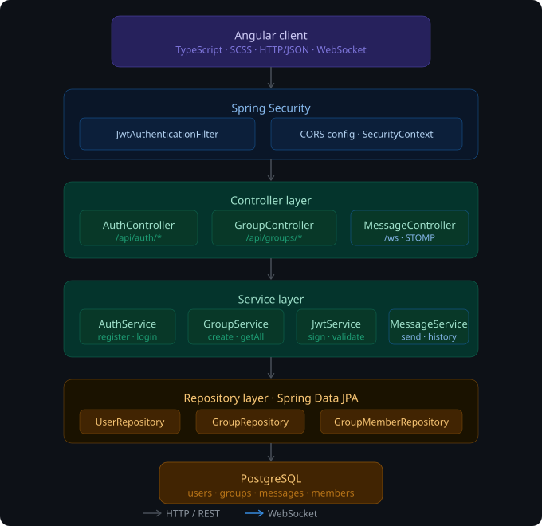

# Pulse
A WhatsApp-style team collaboration app with real-time messaging, built with Angular, Spring Boot, WebSockets, and PostgreSQL.

**Live app:** [pulse-collab-five.vercel.app](https://pulse-collab-five.vercel.app/auth/login)

## Demo
[Watch the demo](https://youtu.be/Sy649vuoW7U)

## Architecture


## Features
- Real-time messaging via WebSockets
- Channel-based team workspaces
- User authentication and session management
- Persistent message history with PostgreSQL

## Tech Stack
| Layer | Technology |
|-------|-----------|
| Frontend | Angular, TypeScript, SCSS |
| Backend | Spring Boot, Java |
| Database | PostgreSQL |
| Real-time | WebSockets |
| DevOps | Docker Compose |

## Run Locally
```bash
docker-compose up
```
Frontend: http://localhost:4200  
Backend: http://localhost:8080
